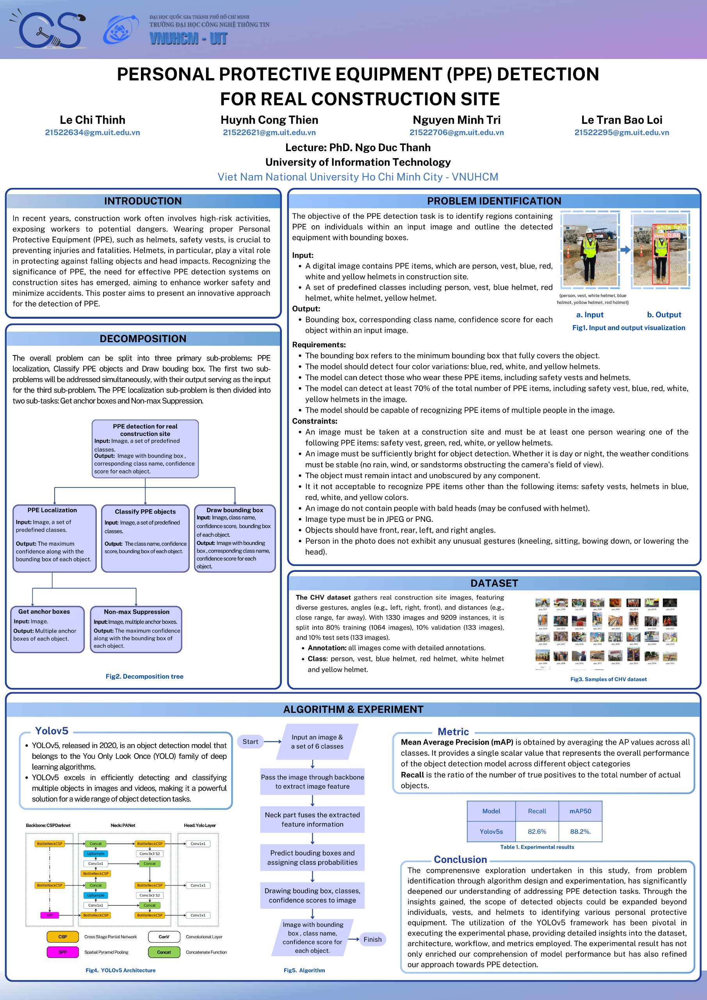

  

<!-- Title -->
<h1 align="center"><b>CS117 - Computational Thinking</b></h1>

## Tabel of contents
* [ Lecturer](#lecturer)
* [ Member](#member)
* [ Project](#project)
## Lecturer

**Dr. Ngo Duc Thanh**

## Member

|**ID**|**Student ID**|**Name**|**Email**|
| ------ |-------------|----------------------|-------------------------|
| 1      | 21522295   	 |Le Tran Bao Loi|21522295@gm.uit.edu.vn|
| 2      | 21522621      |Huynh Cong Thien|21522621@gm.uit.edu.vn|
| 3      | 21522634 	 |Le Chi Thinh|21522634@gm.uit.edu.vn|
| 4      | 21522706      |Nguyen Minh Tri|21522706@gm.uit.edu.vn|
## Project

# PPE DETECTION FOR REAL CONSTRUCTION SITE

## Course information:

-   **Course Name:** Computational Thinking
-   **Course Code:** CS117
-   **Semester:** 1
-   **Year:** 2023 - 2024
-   **Lecturer:** Dr. Ngo Duc Thanh

## Requirements
- Python == 3.9
- Download package: **!pip install -r requirements.txt**
## Run project
- **Dataset:** Group use CHV dataset to train our model.
- **How to run:** streamlit run app.py
## POSTER

